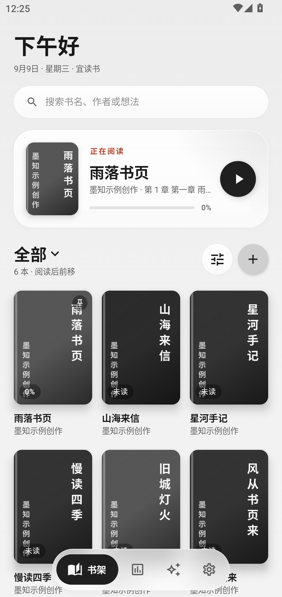
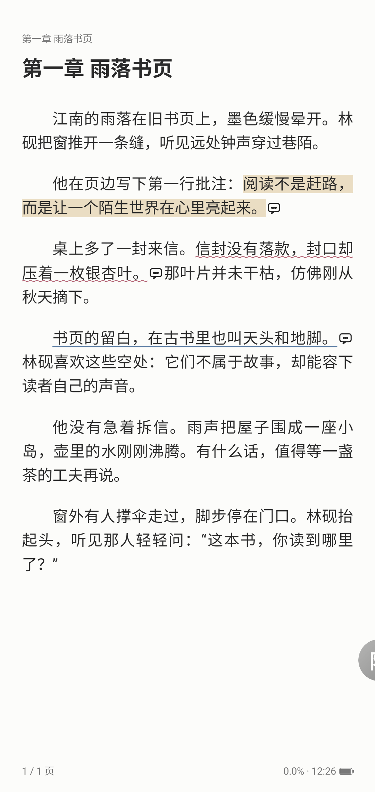
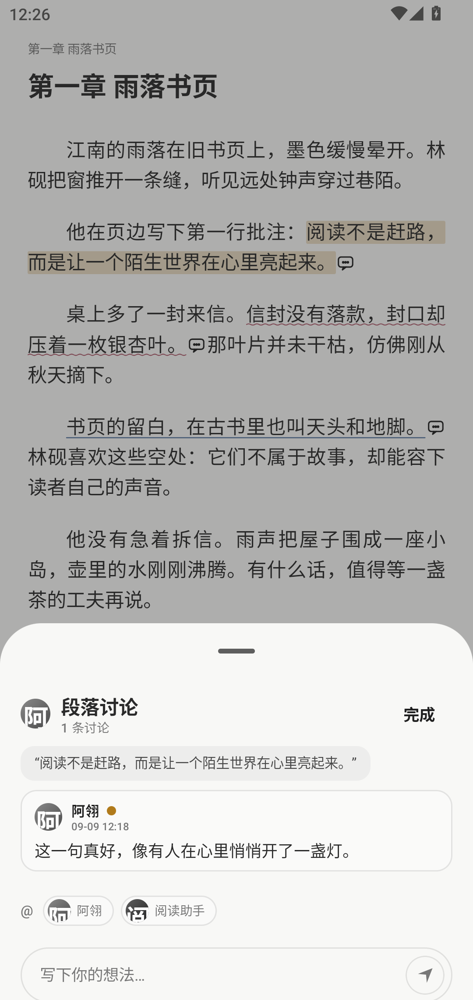

  

<h1 align="center">墨知 MoRead</h1>

<a href="README.md">English</a> · <b>简体中文</b>

极简的原生 Android 本地小说阅读器，内建可深度定制的 AI 伴读。

  
  
  

墨知是一款纯本地、无账号、无数据采集的阅读应用：书籍由你自己导入，AI 功能使用你自己的 API Key（BYOK）直连服务商，不经任何中转服务器。没有网络、没有 Key 时，它就是一个完整可用的本地阅读器。

## 界面预览

以下为 **1080 × 2280 手机竖屏**下的应用直接截图（Android 模拟器）。书籍为原创示例内容；聊天与段评为预设演示数据，**不是在线模型实测结果**。

<table>
  <tr>
    <td align="center" width="50%"> <b>书架</b> · 续读、分组与书籍管理</td>
    <td align="center" width="50%"> <b>阅读</b> · 留白排版与三种段评划线</td>
  </tr>
  <tr>
    <td align="center" width="50%"> <b>AI 伴读</b> · 和角色一起聊正在读的书</td>
    <td align="center" width="50%"> <b>段落讨论</b> · 从一句话展开交流</td>
  </tr>
</table>

## 特性

以下特性以当前源码为准，正式安装包请以对应版本说明为准。

### 阅读

- 自动阅读：可调匀速滚动或定时翻页，在阅读页的小半屏控件中启动、暂停
- 章节大纲：目录旁进入“大纲”，手动保存连贯的章节梗概，按章折叠、展开，原文依据单独查看；各章独立生成，最多同时进行两个模型请求，滚动和切换页签时保留页面位置
- 全书人物：相邻“人物”页签可在确认后扫描整本书，包含未读章节；支持停止、断点继续、查找人物和跳转原文

- TXT / EPUB 导入：编码自动探测，正则分章（Legado 同源规则集），导入前可预览并自定义分章规则
- 自绘排版引擎：仿真 / 覆盖 / 滑动三种翻页；原生 EPUB 精细解析 CSS、块级/行内、浮动、表格、背景与图片；支持选词拖柄、段落批注与评论、书签、书内关键词搜索
- 快捷书签：翻页模式下拉至提示后松手添加书签，重复下拉不会移除已有书签；上下连续滚动模式不启用此手势
- 排版自由：字号、行距、页边距、明暗主题、自定义三色阅读主题；无封面书籍自动生成直排文字封面
- 连续听书：系统 TTS 或云端 AI TTS 逐句朗读，自动翻页与跨章续播，通知栏播放控制，当前句正文高亮
- 书架管理：分组与合集、拖拽排序、置顶与阅读状态；拖入合集时目标保持稳定，长按菜单按空间调整位置并显示在底部导航之上；支持繁简转换并保持阅读定位
- 大屏适配：自适应书架网格与侧边导航，可选双页阅读、阅读与伴读并排显示
- 阅读统计：阅读时长热力图、笔记与 AI 对话计量；笔记可导出 Markdown

### AI 伴读（自带 API Key）

- 书库伴读：不选书也能聊，按需查找本地书籍、核对引文；支持修改消息、开分支、重新生成和中断重试，书架整理方案先预览再确认
- 可选 Rerank：可为检索单独分配重排模型，限制输入和耗时，发送前过滤未读内容；失败保留原排序，不配置就不调用

- 四协议客户端自实现：OpenAI 兼容 / OpenAI Responses / Claude / Gemini，全部流式输出；同一服务商可混配对话、向量、语音、生图模型；Base URL 支持 HTTPS 与可信局域网 HTTP
- 角色卡：兼容 SillyTavern PNG / JSON 卡导入，支持世界书与自定义头像
- 陪读 Agent：理解当前章与全书进度，可按卷部目录精确定位章节，检索原文（向量 + 词法双路），并读回已有划线、笔记与剧情梗概
- 伴读创作：可添加批注、写入或更新笔记、滚动维护单份剧情梗概、生成插图与朗读文本；角色的写入能力在独立二级页用开关管理
- 防剧透范围：伴读对话和章节大纲遵循已读进度；全书人物提取单独确认，资料可能涉及后续情节
- 随读段评：在已读范围内按角色生成批注，支持荧光 / 波浪线 / 直线；全局与单书额度可控，后台任务串行、去重并支持取消
- 角色互动提醒：默认使用免费、无模型调用的数量提示；可选快速模型生成角色口吻的短句，也可完全关闭提醒
- 对话体验：流式输出、会话历史、手动滚动和中止回复；打开已有会话时稳定定位，返回阅读页复用排版缓存
- 长期记忆：对话自动总结固化为向量记忆，在所属书籍、角色及用户面具的边界内跨会话召回
- 选词即问：翻译、解析、提问；AI 建议回复；一键剧情梗概
- 媒体生成：生图支持 OpenAI images 端点 / chat 端点出图 / NovelAI，语音支持系统引擎 / MiniMax / OpenAI 兼容端点，均可独立于模型分配单独配置

### 隐私

- 独立存储页面管理正文、索引、语音和保留记录；移除书籍可保留个人记录，彻底删除需单独选择。图片支持分类与导出，应用字体可以独立设置

- 书籍、批注、笔记、对话全部保存在本机，应用不含任何自有后台服务
- WebDAV 支持手动完整备份、轻量自动备份、上传/下载进度与恢复前校验，恢复准备在后台完成后再安全重启
- API Key 存于 Android EncryptedSharedPreferences，仅在你主动使用 AI 功能时直连你配置的服务商
- 不申请存储全盘权限，书籍经系统文件选择器导入

## 下载

前往 [Releases](https://github.com/ovo066/MoRead/releases) 下载最新正式签名 APK。系统要求 Android 8.0（API 26）及以上。

## 快速上手

1. 书架页导入书籍，或在文件管理器中对 TXT / EPUB 使用「其他应用打开」→ 墨知
2. （可选）设置 → AI 服务商：添加服务商与 API Key，为对话 / 向量 / 语音 / 生图分配模型；语音朗读与生图也可在各自二级页独立配置
3. 阅读页长按选词即可翻译、解析、提问；底部工具栏可打开目录、听书与伴读

## 参与开发

阅读 [代码地图](docs/CODE_MAP.md)，了解模块边界、主要调用链和回归测试入口。

应用界面目前仍以中文为主。已建立 Android 字符串资源与英文资源的 i18n 基础，覆盖书籍长按菜单、部分合集提示、书签手势及导入进度，尚不是完整英文界面。翻译约定与贡献方法见 [本地化指南](docs/LOCALIZATION.md)。

## 从源码构建

- 要求 JDK 21 与 Android SDK 37；克隆后用 Android Studio 打开，或命令行执行 `./gradlew :app:assembleDebug`。应用字节码目标仍为 Java 17，JVM 界面测试需要加载 Markdown 渲染依赖的 Java 21 类。
- Windows 下若仓库位于含中文的路径，可使用 `powershell -ExecutionPolicy Bypass -File scripts/gradle.ps1 <任务>` 规避路径问题
- 正式签名：仓库不包含签名密钥。在根目录放置 `keystore.properties`（`storeFile` / `storePassword` / `keyAlias` / `keyPassword` 四项）后执行 `assembleRelease` 即自动签名；未提供时输出未签名包

## 免责声明

墨知不提供、不内置、不推送任何书籍内容，也没有任何在线书源功能；全部阅读内容由用户自行导入本地文件，因此产生的版权责任由使用者自行承担。AI 功能的输出由用户自行配置的第三方模型生成，不代表本项目立场。

## 许可

本项目以 [GPL-3.0](LICENSE) 许可开源。项目复用了 Legado（GPL-3.0）的章节切分规则集并参考了其阅读器渲染设计，完整第三方清单见 [THIRD_PARTY_NOTICES.md](THIRD_PARTY_NOTICES.md)。
